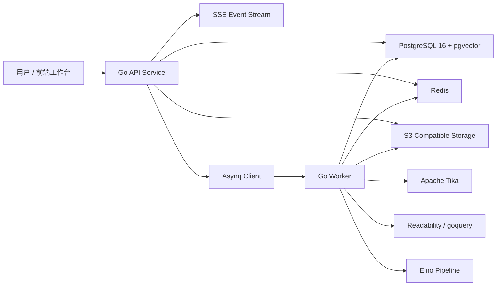
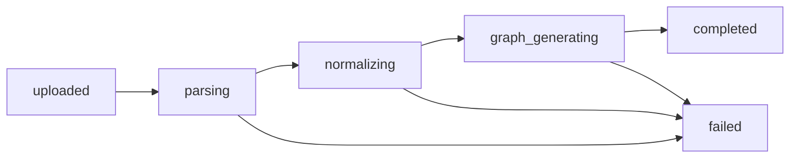

# 学习知识图谱助手后端设计文档

## 1. 文档信息

- 文档名称：后端设计文档
- 文件名：`backend_design.md`
- 适用版本：V1.0
- 输入依据：
  - `requirement.md`
  - `techstack.md`
- 目标：将产品需求和既定技术栈拆解为可实施的后端架构设计、模块设计、函数设计、接口设计、端口设计、任务设计、数据库设计和工程结构设计，确保 V1 范围内功能全部有明确落点。

## 2. 设计目标与边界

### 2.1 设计目标

后端需要完成以下核心目标：

1. 支持分组管理，作为所有资源和图谱的业务根节点。
2. 支持文件和网页两类资源接入，并将其转化为统一标准化内容。
3. 支持异步资源处理流水线，包括解析、标准化、图谱生成、框架图谱生成、索引更新和失败回写。
4. 支持资源级知识图谱与分组级框架图谱的存储、查询、展示和追溯。
5. 支持节点详情、节点扩展和基于节点上下文的侧边栏问答。
6. 支持清晰的状态机、失败恢复、任务重试和基础可观测能力。
7. 在 V1 保持模块化单体架构，优先打通主流程而不是过度分布式。

### 2.2 V1 明确不做

1. 多用户协作和复杂权限体系。
2. 图谱人工编辑体系。
3. 跨分组关联分析和复杂图算法。
4. XLSX 深度语义建模。
5. 复杂推荐系统和学习路径引擎。

## 3. 需求到后端能力映射

| PRD 能力 | 后端模块 | 关键产物 |
| --- | --- | --- |
| 分组创建、查看、重命名、删除 | `group` | 分组表、分组 CRUD API |
| 文件上传、网页提交 | `resource` + `storage` | 原始文件对象、资源记录 |
| 资源解析与标准化 | `parser` + `pipeline` | 提取文本、标准 Markdown、摘要 |
| 资源处理状态展示 | `resource` + `job` + `event` | 状态字段、SSE、任务日志 |
| 资源级知识图谱生成 | `graph` + `pipeline` | 资源图谱、节点、边、示例 |
| 分组级框架图谱生成 | `graph` + `pipeline` | 框架图谱、主题聚合关系 |
| 节点详情查看 | `graph` | 节点解释、意义、关系、例子 |
| 节点扩展生成 | `graph` + `pipeline` | 扩展节点、扩展边、来源标记 |
| 节点上下文问答 | `chat` + `retrieval` | 对话、引用片段、上下文快照 |
| 失败恢复与重试 | `job` | 失败任务、重试入口、错误消息 |

## 4. 总体架构设计

### 4.1 架构原则

1. 单体优先，运行时拆分为 `API` 和 `Worker` 两个进程。
2. 长耗时任务全部异步化，API 不阻塞等待 AI 或文档解析结果。
3. AI 输出必须结构化，禁止直接将自由文本写入核心图谱结构。
4. 所有关键对象都保留来源、版本、状态和错误信息。
5. 图谱查询与上下文检索建立在 PostgreSQL 上，V1 不引入图数据库。

### 4.2 逻辑架构



### 4.3 运行时组件职责

#### API Service

- 提供 REST API。
- 接收文件上传和网页创建请求。
- 查询分组、资源、图谱、节点详情、对话历史。
- 派发异步任务。
- 提供 SSE 状态订阅。

#### Worker Service

- 消费资源处理、图谱生成、索引更新、框架聚合、节点扩展任务。
- 调用 Tika、网页抓取器、Eino 和 Embedding 模型。
- 回写资源状态、任务状态、图谱数据和索引数据。

#### PostgreSQL

- 保存业务主数据。
- 保存图谱结构、对话、任务记录和向量索引。

#### Redis

- Asynq 队列。
- 短期任务状态缓存。
- SSE 广播辅助缓存。

#### 对象存储

- 保存原始文件。
- 保存网页原始抓取快照。
- 保存标准 Markdown、中间文本和调试产物。

## 5. 部署与端口设计

以下端口为推荐默认值，便于本地开发和 Docker Compose 编排。

| 组件 | 默认端口 | 协议 | 说明 |
| --- | --- | --- | --- |
| `web` | `3000` | HTTP | 前端开发服务 |
| `api` | `8080` | HTTP | REST API + SSE |
| `worker` | 无对外端口 | - | 仅消费队列 |
| `postgres` | `5432` | TCP | 主数据库 |
| `redis` | `6379` | TCP | 队列与缓存 |
| `minio` | `9000` | HTTP | S3 API |
| `minio-console` | `9001` | HTTP | MinIO 控制台 |
| `tika` | `9998` | HTTP | 文档解析服务 |
| `prometheus` | `9090` | HTTP | 指标采集 |
| `grafana` | `3001` | HTTP | 监控看板 |
| `otel-collector` | `4317` | gRPC | 可观测采集入口 |

### 5.1 API 路由前缀

- API 前缀：`/api/v1`
- SSE 前缀：`/api/v1/events`
- 健康检查：`/healthz`
- 就绪检查：`/readyz`

### 5.2 内外网暴露建议

1. 对外仅暴露 `web`、`api`。
2. `postgres`、`redis`、`tika`、`minio` 仅在内网或 Docker 网络暴露。
3. `worker` 不需要对外暴露端口。

## 6. 核心业务流程设计

### 6.1 分组创建流程

1. 前端调用 `POST /api/v1/groups`。
2. API 校验名称不能为空、长度限制、名称唯一性策略。
3. 插入 `groups` 记录。
4. 返回分组基础信息。

### 6.2 文件资源上传流程

1. 前端先获取上传凭证或直接通过 API 上传。
2. API 校验分组存在、文件类型合法、文件大小限制。
3. 原始文件写入对象存储。
4. 写入 `resources` 记录，初始状态为 `uploaded`。
5. 写入 `resource_artifacts` 的原始文件产物记录。
6. 创建 `processing_jobs` 主任务。
7. 投递 `parse_resource` 任务。
8. 通过 SSE 向分组频道推送资源状态变化。

### 6.3 网页资源接入流程

1. 前端调用 `POST /api/v1/groups/{groupId}/web-resources`。
2. API 校验 URL 合法性和分组归属。
3. 写入 `resources` 记录，类型为 `web`，状态为 `uploaded`。
4. 投递 `fetch_web_resource` 任务。
5. Worker 抓取正文、清噪、生成 Markdown，并写回 `resource_artifacts`。
6. 后续流程与文件资源统一进入标准化和图谱生成链路。

### 6.4 资源处理流水线



资源处理具体步骤：

1. 解析原始资源，生成提取文本。
2. 标准化为统一 Markdown 和分段结构。
3. 生成资源摘要和结构化片段。
4. 生成资源级知识图谱。
5. 写入节点、边、例子、引用片段。
6. 触发分组框架图谱刷新任务。
7. 触发分组上下文索引刷新任务。

### 6.5 分组框架图谱生成流程

1. 当分组下存在至少一个 `completed` 的资源图谱时，允许生成框架图谱。
2. Worker 读取该分组所有最新的资源级图谱。
3. 进行概念聚合、重复合并、高层主题抽取。
4. 生成一张 `framework` 类型图谱。
5. 将旧版本框架图谱标记为 `archived`，新版本设为 `active`。

### 6.6 节点扩展流程

1. 用户在资源图谱页选择节点并触发扩展。
2. API 校验图谱类型必须为 `resource`，节点必须存在。
3. 创建扩展任务记录。
4. Worker 基于当前节点、邻居节点和分组背景生成一个直接相关的新节点及一条关系。
5. 写入 `graph_nodes`、`graph_edges`，标记 `is_expansion = true`。
6. 推送图谱更新事件。

### 6.7 节点侧边栏问答流程

1. 前端以当前节点为上下文发起对话。
2. API 获取节点详情、相邻一跳节点、所属资源摘要、分组向量召回片段。
3. 构造问答上下文快照并写入消息记录。
4. 调用 Eino 问答链路生成回答。
5. 回答结果以流式或普通响应返回。
6. 记录引用的节点、片段和上下文快照，便于追溯。

## 7. 状态机设计

### 7.1 资源状态机

| 状态 | 含义 | 可进入状态 |
| --- | --- | --- |
| `uploaded` | 已接收资源，尚未开始解析 | `parsing`, `failed` |
| `parsing` | 正在解析文件或网页正文 | `normalizing`, `failed` |
| `normalizing` | 正在生成统一 Markdown、摘要、切片 | `graph_generating`, `failed` |
| `graph_generating` | 正在生成资源级图谱 | `completed`, `failed` |
| `completed` | 资源级图谱已生成完成 | `parsing` |
| `failed` | 任一步骤失败 | `parsing` |

说明：

1. `completed -> parsing` 用于手动重试。
2. 任意失败必须记录 `error_code`、`error_message`、`failed_stage`。

### 7.2 任务状态机

| 状态 | 含义 |
| --- | --- |
| `pending` | 已创建，等待消费 |
| `running` | Worker 处理中 |
| `succeeded` | 成功完成 |
| `failed` | 执行失败 |
| `retrying` | 已失败但仍会自动重试 |
| `cancelled` | 被人工取消 |

### 7.3 图谱状态机

| 状态 | 适用对象 | 说明 |
| --- | --- | --- |
| `draft` | 资源图谱 / 框架图谱 | 正在生成或写入中 |
| `active` | 资源图谱 / 框架图谱 | 当前可查询版本 |
| `archived` | 框架图谱 | 历史版本保留 |
| `failed` | 资源图谱 / 框架图谱 | 生成失败占位记录 |

## 8. 模块与工程结构设计

### 8.1 推荐目录结构

```text
.
├── apps
│   └── api
│       ├── cmd
│       │   ├── api
│       │   └── worker
│       ├── config
│       └── internal
│           ├── bootstrap
│           ├── http
│           │   ├── handler
│           │   ├── middleware
│           │   └── dto
│           ├── domain
│           │   ├── group
│           │   ├── resource
│           │   ├── graph
│           │   ├── chat
│           │   └── job
│           ├── app
│           │   ├── command
│           │   └── query
│           ├── infra
│           │   ├── db
│           │   ├── queue
│           │   ├── objectstorage
│           │   ├── parser
│           │   ├── llm
│           │   ├── embedding
│           │   ├── retrieval
│           │   └── event
│           ├── pipeline
│           └── worker
├── migrations
├── sql
├── deployments
│   └── docker-compose
└── docs
```

### 8.2 分层职责

#### `http`

- 请求解析与响应序列化。
- 参数校验、错误码映射。
- 不直接写 SQL，不直接编排复杂业务。

#### `app`

- 组织命令和查询用例。
- 协调领域服务、仓储和外部依赖。

#### `domain`

- 定义聚合根、实体、值对象、领域规则。
- 包含最核心的业务约束，比如“资源必须归属分组”“扩展节点只能主动触发”。

#### `infra`

- 持久化、对象存储、队列、模型适配器、网页抓取器等实现。

#### `pipeline`

- Eino 工作流封装。
- 统一 AI 结构化输出和提示词输入。

#### `worker`

- 异步任务消费入口。
- 负责重试策略、任务状态回写和链路追踪。

## 9. 领域模型设计

### 9.1 Group 聚合

职责：

- 管理分组生命周期。
- 作为资源、图谱、对话的业务归属根。

核心属性：

- `id`
- `name`
- `description`
- `created_at`
- `updated_at`
- `deleted_at`

领域规则：

1. 名称不能为空。
2. 名称长度建议 `1-100` 字符。
3. 删除分组需要级联清理资源、图谱、对话和任务记录。

### 9.2 Resource 聚合

职责：

- 管理单个文件或网页资源。
- 管理资源状态和处理产物引用。

核心属性：

- `id`
- `group_id`
- `name`
- `resource_type`
- `source_uri`
- `storage_key`
- `status`
- `error_code`
- `error_message`
- `failed_stage`
- `created_at`
- `updated_at`

领域规则：

1. 一个资源只能属于一个分组。
2. 资源类型只能是 `pdf/docx/pptx/xlsx/txt/md/web`。
3. 删除资源要同时删除其图谱、内容切片和索引。

### 9.3 Graph 聚合

职责：

- 管理资源图谱和框架图谱。
- 管理图谱版本、节点和边的归属。

核心属性：

- `id`
- `group_id`
- `resource_id`
- `graph_type`
- `status`
- `version`
- `root_node_id`
- `summary`
- `created_at`
- `updated_at`

领域规则：

1. `resource` 图谱必须绑定 `resource_id`。
2. `framework` 图谱不能绑定单一 `resource_id`。
3. 一个资源同一时刻只允许一张 `active` 资源图谱。
4. 一个分组同一时刻只允许一张 `active` 框架图谱。

### 9.4 Node 实体

职责：

- 表达知识点本身。
- 保存解释、意义、来源、层级和扩展标记。

核心属性：

- `id`
- `graph_id`
- `name`
- `description`
- `meaning`
- `level`
- `node_type`
- `source_type`
- `is_expansion`
- `origin_resource_id`
- `origin_chunk_id`
- `metadata_json`

### 9.5 Edge 实体

职责：

- 表达知识点之间的关系。

核心属性：

- `id`
- `graph_id`
- `source_node_id`
- `target_node_id`
- `relation_type`
- `relation_description`
- `is_expansion_relation`
- `weight`

### 9.6 Conversation 聚合

职责：

- 管理围绕节点的学习对话。

核心属性：

- `id`
- `group_id`
- `graph_id`
- `current_node_id`
- `title`
- `created_at`
- `updated_at`

领域规则：

1. 对话必须绑定分组。
2. 如果由节点触发，则必须绑定 `current_node_id`。
3. 默认上下文不直接把框架图谱作为独立语料源。

## 10. API 设计

### 10.1 统一约定

- 返回格式：

```json
{
  "data": {},
  "error": null,
  "meta": {}
}
```

- 错误格式：

```json
{
  "data": null,
  "error": {
    "code": "RESOURCE_NOT_FOUND",
    "message": "resource not found"
  },
  "meta": {}
}
```

### 10.2 分组接口

#### `POST /api/v1/groups`

用途：创建分组。

请求：

```json
{
  "name": "Go AI Project",
  "description": "可选"
}
```

响应字段：

- `id`
- `name`
- `description`
- `resource_count`
- `created_at`

#### `GET /api/v1/groups`

用途：获取分组列表。

支持参数：

- `page`
- `page_size`
- `keyword`

#### `GET /api/v1/groups/{groupId}`

用途：获取分组详情和统计。

#### `PATCH /api/v1/groups/{groupId}`

用途：重命名分组或更新描述。

#### `DELETE /api/v1/groups/{groupId}`

用途：删除分组及全部级联产物。

### 10.3 资源接口

#### `POST /api/v1/groups/{groupId}/resources`

用途：上传文件资源。

说明：

1. V1 可先走 `multipart/form-data` 直传 API。
2. 后续可扩展为预签名上传。

响应：

- `resource_id`
- `status`
- `job_id`

#### `POST /api/v1/groups/{groupId}/web-resources`

用途：新增网页资源。

请求：

```json
{
  "url": "https://example.com/article",
  "name": "可选，自定义标题"
}
```

#### `GET /api/v1/groups/{groupId}/resources`

用途：获取分组内资源列表。

字段：

- `id`
- `name`
- `resource_type`
- `status`
- `error_message`
- `created_at`
- `updated_at`

#### `GET /api/v1/resources/{resourceId}`

用途：获取资源详情和最新处理产物摘要。

#### `POST /api/v1/resources/{resourceId}/retry`

用途：重新触发处理。

规则：

1. 允许 `failed` 和 `completed` 状态重试。
2. 重试会创建新任务和新图谱版本，不覆盖历史任务记录。

#### `DELETE /api/v1/resources/{resourceId}`

用途：删除资源和派生产物。

### 10.4 图谱接口

#### `GET /api/v1/resources/{resourceId}/graph`

用途：获取资源级知识图谱。

查询参数：

- `include_expansion=true|false`
- `max_level`

响应：

- `graph`
- `nodes`
- `edges`

#### `GET /api/v1/groups/{groupId}/framework-graph`

用途：获取分组级框架图谱。

#### `POST /api/v1/groups/{groupId}/framework-graph/generate`

用途：手动触发框架图谱生成。

规则：

1. 分组下至少有一份完成资源图谱。
2. 若已有运行中任务，返回幂等结果。

#### `GET /api/v1/graphs/{graphId}/nodes/{nodeId}`

用途：获取节点详情。

返回：

- `name`
- `description`
- `meaning`
- `level`
- `node_type`
- `source_type`
- `neighbors`
- `examples`

### 10.5 节点扩展接口

#### `POST /api/v1/graphs/{graphId}/nodes/{nodeId}/expand`

用途：生成一个直接相关的扩展节点。

请求：

```json
{
  "reason": "可选，用户希望理解的方向"
}
```

响应：

- `job_id`
- `status`

### 10.6 对话接口

#### `POST /api/v1/conversations`

用途：创建节点会话。

请求：

```json
{
  "group_id": "grp_xxx",
  "graph_id": "gph_xxx",
  "current_node_id": "node_xxx",
  "title": "可选"
}
```

#### `GET /api/v1/conversations/{conversationId}`

用途：获取会话详情和消息历史。

#### `POST /api/v1/conversations/{conversationId}/messages`

用途：围绕当前节点发起提问。

请求：

```json
{
  "content": "这个节点在项目里的作用是什么？",
  "stream": true
}
```

响应：

1. `stream = true` 时走 SSE 分片输出。
2. `stream = false` 时返回完整回答。

### 10.7 任务与事件接口

#### `GET /api/v1/jobs/{jobId}`

用途：查询任务详情。

#### `GET /api/v1/events/groups/{groupId}`

用途：订阅分组维度事件流。

事件类型建议：

- `resource.status.changed`
- `resource.completed`
- `resource.failed`
- `framework_graph.updated`
- `graph.node.expanded`
- `conversation.message.created`

## 11. 函数与服务设计

以下函数设计以 Go 接口为主，便于后续实现、测试与依赖注入。

### 11.1 GroupService

```go
type GroupService interface {
    CreateGroup(ctx context.Context, cmd CreateGroupCommand) (*Group, error)
    ListGroups(ctx context.Context, query ListGroupsQuery) ([]GroupSummary, error)
    GetGroup(ctx context.Context, groupID string) (*GroupDetail, error)
    UpdateGroup(ctx context.Context, cmd UpdateGroupCommand) (*Group, error)
    DeleteGroup(ctx context.Context, groupID string) error
}
```

### 11.2 ResourceService

```go
type ResourceService interface {
    UploadFile(ctx context.Context, cmd UploadFileResourceCommand) (*UploadResourceResult, error)
    CreateWebResource(ctx context.Context, cmd CreateWebResourceCommand) (*Resource, error)
    ListGroupResources(ctx context.Context, groupID string, query ListResourcesQuery) ([]ResourceSummary, error)
    GetResource(ctx context.Context, resourceID string) (*ResourceDetail, error)
    RetryProcessing(ctx context.Context, resourceID string) (*Job, error)
    DeleteResource(ctx context.Context, resourceID string) error
    UpdateResourceStatus(ctx context.Context, cmd UpdateResourceStatusCommand) error
}
```

### 11.3 ParserService

```go
type ParserService interface {
    ParseFile(ctx context.Context, input ParseFileInput) (*ParsedDocument, error)
    FetchWebPage(ctx context.Context, input FetchWebPageInput) (*FetchedWebPage, error)
    NormalizeContent(ctx context.Context, input NormalizeContentInput) (*NormalizedContent, error)
}
```

职责说明：

1. `ParseFile` 负责与 Tika 通信并解析结构化文本。
2. `FetchWebPage` 负责抓取正文和网页元信息。
3. `NormalizeContent` 负责统一 Markdown、摘要和块级切片。

### 11.4 GraphService

```go
type GraphService interface {
    GetResourceGraph(ctx context.Context, resourceID string, query GetGraphQuery) (*GraphView, error)
    GetFrameworkGraph(ctx context.Context, groupID string, query GetGraphQuery) (*GraphView, error)
    GetNodeDetail(ctx context.Context, graphID string, nodeID string) (*NodeDetail, error)
    GenerateResourceGraph(ctx context.Context, cmd GenerateResourceGraphCommand) (*Graph, error)
    GenerateFrameworkGraph(ctx context.Context, cmd GenerateFrameworkGraphCommand) (*Graph, error)
    ExpandNode(ctx context.Context, cmd ExpandNodeCommand) (*Job, error)
}
```

### 11.5 ChatService

```go
type ChatService interface {
    CreateConversation(ctx context.Context, cmd CreateConversationCommand) (*Conversation, error)
    GetConversation(ctx context.Context, conversationID string) (*ConversationDetail, error)
    AskNodeQuestion(ctx context.Context, cmd AskNodeQuestionCommand) (*ChatAnswer, error)
    StreamNodeQuestion(ctx context.Context, cmd AskNodeQuestionCommand, writer StreamWriter) error
}
```

### 11.6 RetrievalService

```go
type RetrievalService interface {
    IndexResourceChunks(ctx context.Context, cmd IndexResourceChunksCommand) error
    RetrieveGroupContext(ctx context.Context, query RetrieveGroupContextQuery) ([]ContextChunk, error)
    RetrieveNodeNeighbors(ctx context.Context, graphID string, nodeID string, depth int) ([]NodeRelation, error)
}
```

### 11.7 JobService

```go
type JobService interface {
    CreateJob(ctx context.Context, cmd CreateJobCommand) (*Job, error)
    MarkRunning(ctx context.Context, jobID string) error
    MarkSucceeded(ctx context.Context, jobID string, result any) error
    MarkFailed(ctx context.Context, jobID string, err error) error
    RetryJob(ctx context.Context, jobID string) error
    GetJob(ctx context.Context, jobID string) (*JobDetail, error)
}
```

### 11.8 Worker Handler

```go
type ResourceJobHandler interface {
    HandleFetchWebResource(ctx context.Context, payload FetchWebResourcePayload) error
    HandleParseResource(ctx context.Context, payload ParseResourcePayload) error
    HandleNormalizeResource(ctx context.Context, payload NormalizeResourcePayload) error
    HandleGenerateResourceGraph(ctx context.Context, payload GenerateResourceGraphPayload) error
    HandleGenerateFrameworkGraph(ctx context.Context, payload GenerateFrameworkGraphPayload) error
    HandleIndexGroupContext(ctx context.Context, payload IndexGroupContextPayload) error
    HandleExpandNode(ctx context.Context, payload ExpandNodePayload) error
}
```

## 12. 异步任务设计

### 12.1 任务类型

| 任务名 | 触发时机 | 输入 | 输出 |
| --- | --- | --- | --- |
| `fetch_web_resource` | 新建网页资源 | `resource_id`, `url` | 网页正文与 Markdown |
| `parse_resource` | 新资源上传或重试 | `resource_id` | 提取文本 |
| `normalize_resource` | 解析完成 | `resource_id` | 标准 Markdown、摘要、切片 |
| `generate_resource_graph` | 标准化完成 | `resource_id` | 资源图谱 |
| `generate_framework_graph` | 资源图谱更新后 | `group_id` | 框架图谱 |
| `index_group_context` | 标准化完成或图谱更新后 | `group_id`, `resource_id` | 向量索引 |
| `expand_node` | 用户点击扩展 | `graph_id`, `node_id`, `group_id` | 扩展节点和边 |

### 12.2 队列划分

| 队列 | 优先级 | 用途 |
| --- | --- | --- |
| `critical` | 高 | 节点问答流式预处理、用户手动触发扩展 |
| `default` | 中 | 资源处理主流程 |
| `low` | 低 | 框架图谱重建、索引刷新、清理任务 |

### 12.3 重试策略

1. 默认指数退避。
2. 文件解析失败最多重试 `2` 次。
3. AI 图谱生成失败最多重试 `3` 次。
4. `4xx` 类输入错误不自动重试。
5. 失败写入 `processing_jobs.last_error` 和 `resources.error_message`。

### 12.4 幂等策略

1. 同一 `resource_id + stage + version` 只能存在一个活跃任务。
2. 同一节点扩展请求在短时间内使用 `dedupe_key` 去重。
3. 框架图谱生成按 `group_id + active_resource_graph_version_set` 计算幂等键。

## 13. AI 流水线设计

### 13.1 统一约束

1. 所有 AI 输出必须满足 JSON Schema。
2. Prompt 中明确禁止偏离资源主题。
3. 资源图谱、框架图谱、节点扩展、问答使用不同工作流模板。
4. 失败时保存原始模型响应到对象存储调试目录，不直接写数据库主表。

### 13.2 资源图谱生成工作流

输入：

- 资源标准 Markdown
- 资源摘要
- 分段结构
- 资源类型

输出 Schema：

```json
{
  "summary": "string",
  "nodes": [
    {
      "name": "string",
      "description": "string",
      "meaning": "string",
      "level": 1,
      "node_type": "topic",
      "source_type": "extracted",
      "example_texts": ["string"]
    }
  ],
  "edges": [
    {
      "source_name": "string",
      "target_name": "string",
      "relation_type": "contains",
      "relation_description": "string"
    }
  ]
}
```

### 13.3 框架图谱生成工作流

输入：

- 分组下所有 `active` 资源图谱摘要
- 节点高频主题集合
- 资源间概念重合度数据

输出：

- 高层主题节点
- 聚合关系边
- 框架摘要

约束：

1. 只保留高层骨架。
2. 不保留过细粒度例子节点。
3. 对重复概念进行合并。

### 13.4 节点扩展工作流

输入：

- 当前节点详情
- 一跳邻居节点
- 所属分组背景摘要
- 用户可选扩展意图

输出 Schema：

```json
{
  "node": {
    "name": "string",
    "description": "string",
    "meaning": "string",
    "level": 3,
    "node_type": "concept"
  },
  "edge": {
    "relation_type": "related",
    "relation_description": "string"
  }
}
```

约束：

1. 只生成一个扩展节点。
2. 必须与触发节点直接相关。
3. 必须标记为 `source_type = expanded`。

### 13.5 节点问答工作流

输入：

- 当前节点
- 相邻节点
- 当前资源摘要
- 分组召回片段
- 最近会话消息

输出 Schema：

```json
{
  "answer": "string",
  "examples": ["string"],
  "cited_chunk_ids": ["chunk_1"],
  "cited_node_ids": ["node_1"]
}
```

## 14. 数据库设计

### 14.1 设计原则

1. 主数据使用 PostgreSQL 关系模型。
2. 图谱结构采用 `graphs + graph_nodes + graph_edges` 三表建模。
3. 可追溯内容单独建表，不把全部中间产物直接塞进资源表。
4. 向量索引存于 `context_chunks.embedding`。

### 14.2 表结构总览

| 表名 | 用途 |
| --- | --- |
| `groups` | 分组主表 |
| `resources` | 资源主表 |
| `resource_artifacts` | 原始文件、提取文本、Markdown、摘要等产物 |
| `resource_chunks` | 标准化切片和向量检索单元 |
| `graphs` | 图谱主表 |
| `graph_nodes` | 图谱节点 |
| `graph_edges` | 图谱边 |
| `node_examples` | 节点例子 |
| `conversations` | 节点会话 |
| `conversation_messages` | 消息记录 |
| `processing_jobs` | 后台任务 |
| `job_events` | 任务事件流水 |

### 14.3 `groups`

| 字段 | 类型 | 约束 | 说明 |
| --- | --- | --- | --- |
| `id` | `uuid` | PK | 分组 ID |
| `name` | `varchar(100)` | not null | 分组名称 |
| `description` | `text` | null | 描述 |
| `created_at` | `timestamptz` | not null | 创建时间 |
| `updated_at` | `timestamptz` | not null | 更新时间 |
| `deleted_at` | `timestamptz` | null | 软删除时间 |

索引：

- `idx_groups_created_at`
- `idx_groups_deleted_at`

### 14.4 `resources`

| 字段 | 类型 | 约束 | 说明 |
| --- | --- | --- | --- |
| `id` | `uuid` | PK | 资源 ID |
| `group_id` | `uuid` | FK -> groups.id | 所属分组 |
| `name` | `varchar(255)` | not null | 资源名 |
| `resource_type` | `varchar(20)` | not null | `pdf/docx/pptx/xlsx/txt/md/web` |
| `source_uri` | `text` | null | 网页地址或对象存储源地址 |
| `storage_key` | `text` | null | 原始文件对象键 |
| `mime_type` | `varchar(100)` | null | MIME |
| `size_bytes` | `bigint` | null | 文件大小 |
| `status` | `varchar(30)` | not null | 资源状态 |
| `failed_stage` | `varchar(50)` | null | 失败阶段 |
| `error_code` | `varchar(100)` | null | 错误码 |
| `error_message` | `text` | null | 错误说明 |
| `latest_job_id` | `uuid` | null | 最近任务 |
| `created_at` | `timestamptz` | not null | 创建时间 |
| `updated_at` | `timestamptz` | not null | 更新时间 |
| `deleted_at` | `timestamptz` | null | 软删除时间 |

索引：

- `idx_resources_group_id_created_at`
- `idx_resources_group_id_status`
- `idx_resources_latest_job_id`

### 14.5 `resource_artifacts`

用于保存资源处理过程中产生的多版本产物。

| 字段 | 类型 | 约束 | 说明 |
| --- | --- | --- | --- |
| `id` | `uuid` | PK | 产物 ID |
| `resource_id` | `uuid` | FK | 资源 ID |
| `artifact_type` | `varchar(50)` | not null | `raw_file/extracted_text/normalized_md/summary/web_snapshot/debug_response` |
| `version` | `int` | not null | 版本号 |
| `storage_key` | `text` | not null | 对象存储路径 |
| `content_hash` | `varchar(64)` | null | 内容哈希 |
| `metadata_json` | `jsonb` | not null default '{}' | 扩展元数据 |
| `created_at` | `timestamptz` | not null | 创建时间 |

唯一约束：

- `(resource_id, artifact_type, version)`

### 14.6 `resource_chunks`

| 字段 | 类型 | 约束 | 说明 |
| --- | --- | --- | --- |
| `id` | `uuid` | PK | 切片 ID |
| `group_id` | `uuid` | FK | 分组归属 |
| `resource_id` | `uuid` | FK | 资源归属 |
| `artifact_id` | `uuid` | FK | 来源产物 |
| `chunk_index` | `int` | not null | 顺序号 |
| `title` | `varchar(255)` | null | 切片标题 |
| `content` | `text` | not null | 切片正文 |
| `token_count` | `int` | null | token 估算 |
| `embedding` | `vector(1536)` | null | 向量 |
| `metadata_json` | `jsonb` | not null default '{}' | 来源信息 |
| `created_at` | `timestamptz` | not null | 创建时间 |

索引：

- `idx_resource_chunks_group_id`
- `idx_resource_chunks_resource_id`
- `ivfflat_resource_chunks_embedding`

### 14.7 `graphs`

| 字段 | 类型 | 约束 | 说明 |
| --- | --- | --- | --- |
| `id` | `uuid` | PK | 图谱 ID |
| `group_id` | `uuid` | FK | 分组 |
| `resource_id` | `uuid` | null FK | 资源图谱时必填 |
| `graph_type` | `varchar(20)` | not null | `resource/framework` |
| `status` | `varchar(20)` | not null | `draft/active/archived/failed` |
| `version` | `int` | not null | 版本 |
| `root_node_id` | `uuid` | null | 根节点 |
| `summary` | `text` | null | 图谱摘要 |
| `metadata_json` | `jsonb` | not null default '{}' | 统计信息 |
| `created_at` | `timestamptz` | not null | 创建时间 |
| `updated_at` | `timestamptz` | not null | 更新时间 |

索引与约束：

- `idx_graphs_group_id_graph_type_status`
- `idx_graphs_resource_id_status`
- 对 `resource` 图谱建立局部唯一索引：`resource_id where status = 'active'`
- 对 `framework` 图谱建立局部唯一索引：`(group_id, graph_type) where status = 'active'`

### 14.8 `graph_nodes`

| 字段 | 类型 | 约束 | 说明 |
| --- | --- | --- | --- |
| `id` | `uuid` | PK | 节点 ID |
| `graph_id` | `uuid` | FK | 所属图谱 |
| `name` | `varchar(255)` | not null | 节点名 |
| `description` | `text` | null | 概念解释 |
| `meaning` | `text` | null | 在当前主题中的意义 |
| `level` | `int` | not null | 层级 |
| `node_type` | `varchar(30)` | not null | `topic/subtopic/concept/method/rule/conclusion/example` |
| `source_type` | `varchar(30)` | not null | `extracted/summarized/expanded` |
| `is_expansion` | `boolean` | not null default false | 是否扩展节点 |
| `origin_resource_id` | `uuid` | null | 来源资源 |
| `origin_chunk_id` | `uuid` | null | 来源切片 |
| `metadata_json` | `jsonb` | not null default '{}' | 额外信息 |
| `created_at` | `timestamptz` | not null | 创建时间 |

索引：

- `idx_graph_nodes_graph_id_level`
- `idx_graph_nodes_graph_id_is_expansion`
- `idx_graph_nodes_origin_chunk_id`

### 14.9 `graph_edges`

| 字段 | 类型 | 约束 | 说明 |
| --- | --- | --- | --- |
| `id` | `uuid` | PK | 边 ID |
| `graph_id` | `uuid` | FK | 所属图谱 |
| `source_node_id` | `uuid` | FK | 起始节点 |
| `target_node_id` | `uuid` | FK | 目标节点 |
| `relation_type` | `varchar(30)` | not null | `contains/hierarchy/related/depends_on/derives` |
| `relation_description` | `text` | null | 关系解释 |
| `is_expansion_relation` | `boolean` | not null default false | 是否扩展边 |
| `weight` | `numeric(5,2)` | null | 置信度或权重 |
| `created_at` | `timestamptz` | not null | 创建时间 |

索引：

- `idx_graph_edges_graph_id`
- `idx_graph_edges_source_node_id`
- `idx_graph_edges_target_node_id`

### 14.10 `node_examples`

| 字段 | 类型 | 约束 | 说明 |
| --- | --- | --- | --- |
| `id` | `uuid` | PK | 示例 ID |
| `node_id` | `uuid` | FK | 节点 |
| `example_text` | `text` | not null | 示例文本 |
| `source_type` | `varchar(30)` | not null | `extracted/generated` |
| `origin_chunk_id` | `uuid` | null | 来源切片 |
| `created_at` | `timestamptz` | not null | 创建时间 |

### 14.11 `conversations`

| 字段 | 类型 | 约束 | 说明 |
| --- | --- | --- | --- |
| `id` | `uuid` | PK | 会话 ID |
| `group_id` | `uuid` | FK | 分组 |
| `graph_id` | `uuid` | FK | 图谱 |
| `current_node_id` | `uuid` | FK | 当前节点 |
| `title` | `varchar(255)` | null | 标题 |
| `created_at` | `timestamptz` | not null | 创建时间 |
| `updated_at` | `timestamptz` | not null | 更新时间 |

### 14.12 `conversation_messages`

| 字段 | 类型 | 约束 | 说明 |
| --- | --- | --- | --- |
| `id` | `uuid` | PK | 消息 ID |
| `conversation_id` | `uuid` | FK | 会话 |
| `group_id` | `uuid` | FK | 分组冗余 |
| `current_node_id` | `uuid` | FK | 当前节点 |
| `role` | `varchar(20)` | not null | `user/assistant/system` |
| `content` | `text` | not null | 消息内容 |
| `context_snapshot_json` | `jsonb` | not null default '{}' | 上下文快照 |
| `citations_json` | `jsonb` | not null default '[]' | 引用片段和节点 |
| `created_at` | `timestamptz` | not null | 创建时间 |

索引：

- `idx_conversation_messages_conversation_id_created_at`

### 14.13 `processing_jobs`

| 字段 | 类型 | 约束 | 说明 |
| --- | --- | --- | --- |
| `id` | `uuid` | PK | 任务 ID |
| `group_id` | `uuid` | FK | 分组 |
| `resource_id` | `uuid` | null FK | 资源相关任务 |
| `graph_id` | `uuid` | null FK | 图谱相关任务 |
| `job_type` | `varchar(50)` | not null | 任务类型 |
| `queue_name` | `varchar(30)` | not null | 队列 |
| `status` | `varchar(20)` | not null | 任务状态 |
| `attempt` | `int` | not null default 0 | 已执行次数 |
| `max_attempts` | `int` | not null default 3 | 最大重试 |
| `payload_json` | `jsonb` | not null default '{}' | 输入 |
| `result_json` | `jsonb` | not null default '{}' | 输出摘要 |
| `last_error` | `text` | null | 最后错误 |
| `started_at` | `timestamptz` | null | 开始时间 |
| `finished_at` | `timestamptz` | null | 结束时间 |
| `created_at` | `timestamptz` | not null | 创建时间 |

索引：

- `idx_processing_jobs_resource_id_created_at`
- `idx_processing_jobs_group_id_status`
- `idx_processing_jobs_job_type_status`

### 14.14 `job_events`

| 字段 | 类型 | 约束 | 说明 |
| --- | --- | --- | --- |
| `id` | `uuid` | PK | 事件 ID |
| `job_id` | `uuid` | FK | 任务 ID |
| `event_type` | `varchar(50)` | not null | `created/running/retrying/succeeded/failed` |
| `message` | `text` | null | 说明 |
| `detail_json` | `jsonb` | not null default '{}' | 详细上下文 |
| `created_at` | `timestamptz` | not null | 时间 |

## 15. 查询与索引设计

### 15.1 高频查询

1. 按分组获取资源列表和状态。
2. 按资源获取最新图谱。
3. 按分组获取最新框架图谱。
4. 按节点获取详情和一跳邻居。
5. 按分组做向量召回。
6. 按会话读取消息历史。

### 15.2 关键 SQL 思路

#### 资源列表查询

- 以 `group_id + created_at desc` 为主索引。
- 资源状态列表页避免联结大表，图谱统计可单独查询或异步缓存。

#### 节点详情查询

- 主节点查询走 `graph_nodes.id`。
- 邻居关系通过 `graph_edges.source_node_id` 和 `graph_edges.target_node_id` 双向查一跳。

#### 向量召回

- 先过滤 `group_id`，再进行 `<->` 距离排序。
- 每次召回建议 `top_k = 8-12`。

## 16. 接口安全与校验设计

### 16.1 输入校验

1. 分组名不能为空，长度受限。
2. 上传文件限制大小和 MIME 白名单。
3. 网页 URL 必须为合法 `http/https`。
4. 节点扩展仅允许资源图谱节点，不允许框架图谱直接扩展。

### 16.2 访问控制

V1 不做复杂权限体系，但建议保留以下抽象：

1. `actor_id` 字段预留。
2. HTTP 中间件预留认证钩子。
3. 数据访问层以 `group_id` 为主要隔离维度。

### 16.3 幂等与防重

1. 上传接口支持 `Idempotency-Key`。
2. 问答接口可附带 `client_message_id` 防止重复提交。
3. 手动生成框架图谱时按分组去重运行中任务。

## 17. 可观测与运维设计

### 17.1 日志

日志字段建议统一包含：

- `trace_id`
- `group_id`
- `resource_id`
- `graph_id`
- `job_id`
- `stage`
- `duration_ms`
- `error_code`

### 17.2 指标

至少暴露以下指标：

- `http_request_duration_seconds`
- `resource_processing_duration_seconds`
- `resource_processing_fail_total`
- `graph_generation_fail_total`
- `framework_generation_duration_seconds`
- `chat_request_duration_seconds`
- `queue_job_inflight`

### 17.3 Trace

对以下链路开启 Trace：

1. 上传资源。
2. 调用 Tika。
3. 调用网页抓取。
4. 调用 Eino / LLM。
5. 向量检索。
6. SSE 推送。

## 18. 测试设计

### 18.1 单元测试

覆盖：

1. 分组名称校验。
2. 资源状态流转。
3. 节点扩展约束。
4. 问答上下文组装。

### 18.2 集成测试

覆盖：

1. 上传文件到对象存储并写库。
2. Worker 处理资源后产出图谱。
3. 失败重试后状态正确回写。
4. 分组框架图谱重建。

### 18.3 端到端测试

覆盖：

1. 创建分组。
2. 上传资源。
3. 观察状态变化直到完成。
4. 打开图谱并请求节点详情。
5. 触发扩展节点。
6. 发起节点问答。

## 19. 验收对照

| 验收项 | 设计落点 |
| --- | --- |
| 分组 CRUD | `groups` 表 + 分组 API + GroupService |
| 多类型资源上传 | `resources`、对象存储、ParserService |
| 资源状态可见 | 资源状态机 + `processing_jobs` + SSE |
| 资源图谱生成 | `generate_resource_graph` 任务 + `graphs/nodes/edges` |
| 框架图谱生成 | `generate_framework_graph` 任务 + `framework` 图谱 |
| 层级展示控制 | `graph_nodes.level` + 图谱查询参数 |
| 节点详情 | `GET /graphs/{graphId}/nodes/{nodeId}` |
| 扩展节点 | `expand_node` 任务 + `is_expansion` |
| 节点对话 | `conversations/messages` + RetrievalService + ChatService |

## 20. 风险与设计应对

### 20.1 多格式解析质量不稳定

应对：

1. 解析与标准化分层，保留中间产物便于重跑。
2. 所有资源类型统一落到标准 Markdown，再进入图谱生成。

### 20.2 图谱生成漂移

应对：

1. 强制结构化输出。
2. 保存来源切片和来源类型。
3. 对节点和边建立最小字段校验。

### 20.3 框架图谱过度抽象

应对：

1. 框架图谱单独工作流，不直接复用资源图谱模板。
2. 约束节点数量和层级深度，强调主题骨架。

### 20.4 问答偏离节点主线

应对：

1. 检索时优先当前节点和一跳邻居。
2. 分组背景只作为补充语境。
3. 在 Prompt 中显式禁止脱离当前节点。

## 21. 推荐实施顺序

1. 建立数据库迁移、对象存储接入、分组与资源基础 CRUD。
2. 打通文件上传、网页接入、任务队列和资源状态流转。
3. 完成解析与标准化产物落库。
4. 实现资源级图谱生成与查询。
5. 实现分组框架图谱生成。
6. 实现节点详情、扩展节点和节点问答。
7. 接入 SSE、监控和测试补齐。

## 22. 结论

该后端设计以模块化单体为核心，通过 `Go API + Go Worker + PostgreSQL + Redis + S3 + Tika + Eino` 支撑 V1 的完整主流程。设计重点放在三个方面：一是资源处理流水线和状态机清晰可恢复，二是图谱和问答的数据结构可追溯，三是所有 PRD 功能都能落到明确的模块、函数、接口、任务和数据库结构上。这套设计既足以支持当前版本开发，也为后续增加多用户、图谱编辑和更复杂知识处理能力预留了扩展空间。
