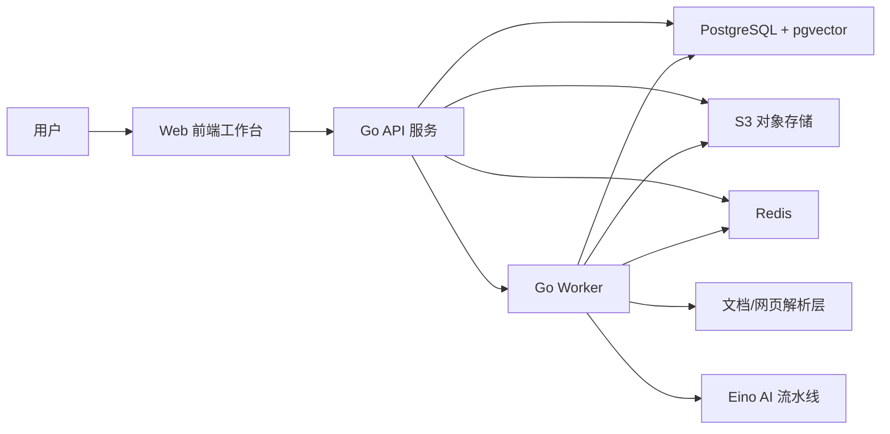

# 学习知识图谱助手技术栈文档

## 1. 文档目标

本文档基于 [requirement.md](/Users/tylor/Code/GoAIPj/requirement.md) 与 [front_requirement.md](/Users/tylor/Code/GoAIPj/front_requirement.md) 的 V1 需求，给出一套适合当前项目的技术栈方案，并明确每一类技术在系统中的职责边界、落地原因与实施优先级。

本文档默认遵循以下前提：

- 后端主技术方向采用 `Go + Eino`
- 第一版聚焦单用户或轻量用户场景，不引入复杂权限体系
- 第一版优先保证“可上传、可处理、可生成图谱、可浏览、可问答”，而不是过早追求复杂分布式架构
- 资源解析、图谱生成、框架图谱生成、对话问答均需要异步与 AI 能力支撑

## 2. 需求反推出来的核心技术问题

从需求文档可以直接推导出，系统必须解决以下技术问题：

1. 多格式资源接入  
   需要统一接收 `PDF / DOCX / PPTX / XLSX / TXT / MD / 网页链接`，并完成标准化处理。

2. 异步资源处理流水线  
   上传后会经历 `解析 -> 总结/标准化 -> 图谱生成 -> 状态回写`，不适合全部同步阻塞。

3. 图谱数据建模与可视化  
   需要支持资源级图谱、分组级框架图谱、节点层级、边关系、扩展节点和来源标记。

4. 基于节点上下文的 AI 能力  
   需要围绕“当前节点 + 当前分组背景知识”进行问答，而不是泛聊天。

5. 可追溯的数据结构  
   需要保留节点来源、示例来源、是否扩展节点、资源处理状态等元数据。

6. 工具型工作台前端  
   前端重点是三栏工作台、稳定图谱交互、节点详情面板、侧栏问答，而不是营销型页面。

## 3. 总体技术架构建议

V1 建议采用“单仓库 + 前后端分层 + 异步任务处理”的架构，而不是一开始拆分成多个微服务。

### 3.1 架构原则

- `单体优先`：先用模块化单体架构把主流程打通，降低协作和部署复杂度
- `异步优先`：文件解析、网页抓取、图谱生成、框架图谱聚合全部走后台任务
- `数据可追溯`：所有 AI 生成结果保留来源字段与任务记录
- `前端图谱优先`：图谱交互是产品核心，前端选型必须优先服务画布能力
- `关系型数据库优先`：V1 不急着上图数据库，先用 PostgreSQL 建好稳定数据模型

### 3.2 架构分层



## 4. 推荐技术栈总览

| 层级 | 推荐技术 | 主要职责 | 选型原因 |
| --- | --- | --- | --- |
| 前端框架 | React 19 + TypeScript + Vite | 构建三栏工作台、资源管理页、图谱页、节点详情与对话侧栏 | 开发效率高，生态成熟，适合重交互 SPA |
| 路由 | React Router | 分组列表、分组详情、资源图谱等页面路由管理 | 轻量清晰，适合独立前端应用 |
| 服务端状态 | TanStack Query | 资源列表、图谱数据、任务状态拉取与缓存 | 适合异步接口、轮询、缓存失效控制 |
| 前端本地状态 | Zustand | 当前选中节点、画布控制、筛选条件、侧栏状态 | 简洁直接，适合画布和局部 UI 状态 |
| UI 基础能力 | Tailwind CSS + Radix UI | 落地设计规范、表单、弹层、对话框、面板 | 易于做自定义设计，不被组件库风格绑死 |
| 图谱渲染 | React Flow | 节点拖动、缩放、平移、连线展示、自定义节点 | 非常适合知识图谱/流程画布类交互 |
| 图谱自动布局 | ELK.js | 资源图谱与框架图谱的自动排布 | 对层级结构图布局效果稳定 |
| 后端 API | Go 1.23+ + Gin | 提供 REST API、上传接口、图谱接口、问答接口、状态查询 | 轻量、成熟、与 Go 生态兼容好 |
| AI 编排 | Eino | 解析后处理、图谱生成、框架图谱生成、节点扩展、问答链路编排 | 与需求方向一致，适合构建可组合 AI 流程 |
| 数据访问 | pgx + sqlc | 强类型 SQL 访问、模式清晰、便于维护追溯字段 | 比 ORM 更可控，适合核心业务数据 |
| 主数据库 | PostgreSQL 16 | 存储分组、资源、图谱、节点、边、对话、任务记录 | 稳定、事务强、适合结构化主数据 |
| 向量检索 | pgvector | 存储资源片段/节点 embedding，用于分组背景检索 | V1 可直接复用 PostgreSQL，避免引入独立向量库 |
| 缓存与队列 | Redis + Asynq | 异步任务派发、重试、状态控制、短期缓存 | Go 生态成熟，适合处理流水线 |
| 文件存储 | S3 兼容对象存储 | 保存原始文件、网页快照、标准化 Markdown、中间产物 | 适合多文件类型和后续扩展 |
| 文档解析 | Apache Tika + 自定义解析适配层 | 多格式文本抽取与基础结构解析 | 覆盖格式广，适合 V1 快速统一接入 |
| 网页抽取 | goquery + Readability | 抓取正文、清理噪音、标准化网页内容 | 适合网页正文提取场景 |
| Markdown 处理 | Goldmark | 规范化 Markdown 内容、输出统一文本 | Go 生态常用，接入简单 |
| 实时反馈 | SSE | 将处理状态推送到前端 | 比 WebSocket 更简单，足够支撑任务状态刷新 |
| 日志与观测 | OpenTelemetry + Prometheus + Grafana | 请求追踪、任务耗时、失败率、系统监控 | 便于定位解析失败、图谱生成失败 |
| 前端异常监控 | Sentry | 捕获图谱交互异常、页面错误 | 图谱页交互复杂，需要单独监控 |
| 测试 | Go test / Testcontainers / Vitest / Playwright | 后端单测、集成测试、前端组件测试、关键流程 E2E | 能覆盖上传、图谱生成、问答主流程 |
| 部署 | Docker Compose（开发）+ Docker 部署（生产） | 本地联调与生产部署 | V1 复杂度可控，部署门槛低 |

## 5. 各技术栈详细职责

### 5.1 前端技术栈

#### 5.1.1 `React 19 + TypeScript + Vite`

职责：

- 构建整个学习工作台前端
- 承载分组列表页、分组详情页、资源图谱页、框架图谱页
- 落地 [front_requirement.md](/Users/tylor/Code/GoAIPj/front_requirement.md) 中的三段式布局、浅色理性风格和稳定交互

为什么适合：

- 本项目是强交互单页应用，不是传统服务端模板站点
- 图谱画布、右侧详情、侧边栏对话都依赖细粒度前端状态控制
- TypeScript 能约束图谱节点、边、资源状态等复杂数据结构

#### 5.1.2 `React Router`

职责：

- 管理 `/groups`、`/groups/:id`、`/groups/:id/resources/:resourceId/graph` 等路由
- 维持页面上下文切换与 URL 状态可分享性

#### 5.1.3 `TanStack Query`

职责：

- 请求资源列表、图谱详情、节点详情、对话历史
- 对资源处理状态做轮询或失效刷新
- 控制上传成功后的数据刷新

为什么适合：

- 本项目有大量“服务端异步处理 + 前端状态展示”的场景
- 比手写 `useEffect + fetch` 更稳定

#### 5.1.4 `Zustand`

职责：

- 保存当前选中节点
- 保存图谱层级过滤范围
- 保存是否显示扩展节点
- 保存右侧面板展开状态、当前聚焦节点等局部交互状态

为什么适合：

- 图谱页是高交互场景，组件间联动多
- Zustand 比全局 Redux 更轻，更适合 V1

#### 5.1.5 `Tailwind CSS + CSS Variables + Radix UI`

职责：

- 承载颜色、间距、圆角、字体等设计 Token
- 实现按钮、输入框、弹窗、下拉、面板等基础组件
- 保证界面能贴合设计规范中的“冷静、轻量、知识型工作台”风格

为什么适合：

- 设计文档对颜色、圆角、字号、状态都有明确要求
- 直接依赖重型现成 UI 库容易被默认视觉风格绑死
- Tailwind + Token 更适合精细还原界面规范

建议额外约束：

- 所有颜色都通过 `CSS Variables` 统一管理
- 图谱节点颜色、状态色、面板色单独建 token
- 不直接堆叠大量第三方现成样式

### 5.2 图谱前端技术栈

#### 5.2.1 `React Flow`

职责：

- 绘制资源级图谱与框架图谱
- 支持节点拖动、缩放、平移、节点点击、视口控制
- 支持自定义节点外观和选中高亮

为什么适合：

- 本项目图谱核心需求与 React Flow 的交互模型高度一致
- 可以方便做“普通节点 / 扩展节点 / 当前选中节点”视觉区分
- 便于与右侧节点详情面板联动

#### 5.2.2 `ELK.js`

职责：

- 对资源图谱进行层级化自动布局
- 对分组框架图谱进行较稳定的概览型布局
- 在“重新布局”操作时重新计算节点位置

为什么适合：

- 需求明确要求结构清晰、节点不过度重叠、适合层级展示
- ELK 对分层图、树状图和有向关系图表现较稳定

#### 5.2.3 图谱前端职责边界

前端图谱层负责：

- 可视化展示
- 交互状态控制
- 视口与层级过滤
- 节点高亮与详情联动

前端图谱层不负责：

- 决定知识结构本身
- 自动生成节点和边
- 决定节点之间的业务语义

这些职责应在后端 AI 与图谱生成模块中完成。

### 5.3 后端 API 技术栈

#### 5.3.1 `Go + Gin`

职责：

- 对外提供统一 API
- 处理分组、资源、图谱、节点详情、问答、扩展节点等业务接口
- 管理文件上传与对象存储写入
- 派发后台任务

推荐接口形态：

- `REST API` 作为主接口
- `SSE` 作为资源处理状态实时更新通道

为什么适合：

- V1 的业务边界清晰，REST 足够表达
- SSE 足够覆盖“解析中 / 总结中 / 图谱生成中 / 已完成 / 失败”的状态流转

#### 5.3.2 `pgx + sqlc`

职责：

- 管理数据库读写
- 保证表结构、查询语句和 Go 类型之间的一致性
- 支撑图谱节点、边、来源字段、任务记录等稳定数据访问

为什么适合：

- 需求里有很多明确的数据字段和追溯字段
- 比 ORM 更适合做强约束业务模型
- 更便于优化图谱、任务、对话相关查询

### 5.4 AI 与知识处理技术栈

#### 5.4.1 `Eino`

职责：

- 编排资源标准化处理链
- 编排资源级知识图谱生成链
- 编排分组级框架图谱生成链
- 编排节点扩展链
- 编排节点上下文问答链

可以拆成以下几类工作流：

1. `资源处理工作流`
   从解析文本生成标准化内容、摘要、结构化片段

2. `资源图谱生成工作流`
   从标准化内容中抽取主题、子主题、概念、方法、规则、结论和边关系

3. `框架图谱聚合工作流`
   从多个资源级图谱中抽取高层骨架并做概念合并

4. `节点扩展工作流`
   基于当前节点和分组背景生成克制的补充节点

5. `节点问答工作流`
   基于当前节点、邻居节点、分组背景片段输出聚焦回答

#### 5.4.2 LLM Provider 适配层

职责：

- 提供聊天模型调用能力
- 提供 embedding 能力
- 隔离模型供应商差异

建议做法：

- 在 Eino 下方增加统一 `model adapter`
- 聊天模型与 embedding 模型分开配置
- 所有 prompt、结构化输出 schema、超时与重试策略集中管理

这样做的原因：

- 图谱生成与问答需要不同模型能力
- 后续替换模型供应商时，不需要重写业务层

#### 5.4.3 结构化输出约束

职责：

- 将 AI 输出限制为稳定 JSON 结构
- 减少图谱生成漂移和字段缺失

建议：

- 资源图谱生成输出固定为 `nodes[] + edges[] + summary`
- 节点扩展输出固定为 `new_node + relation`
- 问答输出固定为 `answer + examples + cited_context_ids`

这对需求中的“可追溯性”和“回答不漂移”非常关键。

### 5.5 异步任务与队列技术栈

#### 5.5.1 `Redis + Asynq`

职责：

- 承接上传后的后台处理任务
- 做任务重试、失败记录、超时控制
- 把长耗时工作从 API 请求中拆出去

建议任务类型：

- `parse_resource`
- `normalize_resource`
- `generate_resource_graph`
- `generate_group_framework_graph`
- `generate_node_expansion`
- `reindex_group_context`

为什么这是 V1 必需：

- 文件解析和 AI 生成明显是长耗时任务
- 需求明确需要状态管理和失败恢复
- 不做异步会直接损伤上传体验与可用性

### 5.6 存储与数据技术栈

#### 5.6.1 `PostgreSQL 16`

职责：

- 存储分组、资源、图谱、节点、边、对话、任务记录
- 管理状态机和可追溯字段
- 支撑筛选、排序、关联查询

建议存储的数据实体：

- `groups`
- `resources`
- `resource_contents`
- `graphs`
- `graph_nodes`
- `graph_edges`
- `conversations`
- `conversation_messages`
- `processing_jobs`
- `node_examples`

#### 5.6.2 `pgvector`

职责：

- 保存资源片段、节点解释、标准化摘要的向量
- 支撑“当前分组背景知识”的语义检索
- 为问答链路提供背景片段召回

为什么推荐：

- 当前项目需要的是“围绕分组背景做检索增强”，而不是超大规模向量检索平台
- V1 直接放在 PostgreSQL 里即可，降低系统复杂度

#### 5.6.3 `S3 兼容对象存储`

职责：

- 保存原始上传文件
- 保存网页快照或抓取结果
- 保存标准化 Markdown 文件
- 保存中间产物，例如清洗后的文本、导出结果

为什么不能只放数据库：

- 原始文件和中间产物体积大
- 后续可能需要重新解析或重新生成图谱
- 对象存储更适合长期保留二进制资源

### 5.7 文档解析与网页抽取技术栈

#### 5.7.1 `Apache Tika`

职责：

- 对多格式文件进行统一文本提取
- 提供 PDF、DOCX、PPTX、XLSX、TXT、MD 的基础解析能力

为什么推荐：

- 需求支持的格式较多
- 如果完全手写每个格式的解析链，V1 成本高且稳定性差
- Tika 更适合作为统一解析入口

#### 5.7.2 `goquery + Readability`

职责：

- 抓取网页内容
- 提取正文
- 清理广告、导航、噪音区块
- 生成标准化网页文本与 Markdown 输入

建议策略：

- 静态网页优先使用轻量抓取
- 动态网页如果后续确实需要，再补 headless browser 抓取能力

这符合 V1 “先保证主流程可用”的原则。

#### 5.7.3 `Goldmark`

职责：

- 对 Markdown 做规范化处理
- 统一网页总结结果与上传 Markdown 文档的输入结构

### 5.8 问答与上下文构建技术栈

#### 5.8.1 节点上下文构建模块

职责：

- 读取当前节点
- 读取相邻节点与关系说明
- 读取当前分组下召回的背景片段
- 组装给问答模型的上下文

这是一个业务模块，不是单一第三方库，但它必须是后端中的独立模块。

建议输入来源：

- 当前节点详情
- 当前节点相邻 1 跳节点
- 当前资源的标准化摘要
- 当前分组下召回的若干背景片段

#### 5.8.2 为什么不建议 V1 直接引入图数据库

不推荐一开始就上 `Neo4j` 或类似图数据库，原因如下：

- 当前核心问题是“生成和浏览知识图谱”，不是做复杂图算法
- 节点、边、来源、状态等数据完全可以先用关系型模型表达
- V1 真正的难点在解析质量、AI 结构化生成质量和前端交互，不在存储引擎

因此建议：

- V1 用 PostgreSQL 存图谱
- 当后续出现复杂跨图查询、路径推理、图分析需求时，再评估图数据库

### 5.9 实时反馈与可观测技术栈

#### 5.9.1 `SSE`

职责：

- 向前端推送资源处理状态变化
- 更新“解析中 / 总结中 / 图谱生成中 / 已完成 / 失败”等状态

为什么优先用 SSE：

- 单向通知足够满足当前需求
- 比 WebSocket 更简单，后端实现成本更低

#### 5.9.2 `OpenTelemetry + Prometheus + Grafana`

职责：

- 记录接口耗时、任务耗时、失败率
- 观察图谱生成、网页抓取、问答调用的性能
- 帮助定位哪一环导致资源处理失败

#### 5.9.3 `Sentry`

职责：

- 前端记录运行时异常
- 后端记录关键错误聚合

图谱页面交互复杂，没有错误监控会很难定位线上问题。

### 5.10 测试技术栈

#### 5.10.1 后端测试

推荐：

- `Go test`：单元测试与服务测试
- `Testcontainers`：数据库、Redis、对象存储联调测试

职责：

- 验证资源状态流转
- 验证图谱数据写入
- 验证对话上下文组装逻辑

#### 5.10.2 前端测试

推荐：

- `Vitest`：组件与状态逻辑测试
- `Playwright`：上传资源、查看状态、进入图谱、选中节点、发起问答等 E2E 流程

职责：

- 验证三栏布局核心流程
- 验证图谱交互可用性
- 验证右侧详情与对话联动

### 5.11 部署技术栈

#### 5.11.1 `Docker Compose` 作为本地开发环境

职责：

- 启动 PostgreSQL
- 启动 Redis
- 启动对象存储
- 启动 Tika
- 启动 API 服务与 Worker

为什么适合：

- 当前仓库处于项目初始化阶段
- 本地一键拉起依赖比过早上 Kubernetes 更重要

#### 5.11.2 生产部署建议

V1 可采用：

- 前端静态站点部署
- Go API 与 Go Worker 分开部署
- PostgreSQL 托管服务
- Redis 托管服务
- S3 兼容对象存储

这比把所有能力硬塞进一个进程更适合后续扩容，但仍然保持整体架构简洁。

## 6. 技术模块与需求映射

| 需求能力 | 主要技术模块 | 负责内容 |
| --- | --- | --- |
| 分组管理 | React + Gin + PostgreSQL | 分组 CRUD、列表展示、进入分组 |
| 多格式资源上传 | 前端上传组件 + Gin + S3 | 文件/网页提交、原始资源保存 |
| 资源状态管理 | PostgreSQL + Redis + Asynq + SSE | 状态流转、失败重试、前端状态同步 |
| 网页正文提取 | goquery + Readability + Goldmark | 正文抽取、清洗、Markdown 标准化 |
| 文件解析 | Apache Tika | 统一文本抽取 |
| 资源级图谱生成 | Eino + LLM + PostgreSQL | 节点/边生成、来源字段写入 |
| 分组框架图谱生成 | Eino + 聚合逻辑 + PostgreSQL | 多图谱合并、高层骨架生成 |
| 图谱可视化 | React Flow + ELK.js | 布局、节点展示、层级过滤、交互 |
| 节点详情 | Gin + PostgreSQL + React 详情面板 | 展示解释、意义、例子、关系 |
| 扩展节点生成 | Eino + Asynq + PostgreSQL | 用户触发扩展节点与边 |
| 节点上下文问答 | Eino + pgvector + 上下文构建模块 | 节点聚焦回答、背景召回 |

## 7. 推荐的数据建模方向

为了匹配需求中的追溯性和状态管理，建议在数据层保留以下关键字段：

### 7.1 资源表关键字段

- `id`
- `group_id`
- `name`
- `resource_type`
- `source_uri`
- `storage_key`
- `status`
- `parse_text_version`
- `normalized_content_version`
- `error_message`
- `created_at`
- `updated_at`

### 7.2 节点表关键字段

- `id`
- `graph_id`
- `name`
- `description`
- `meaning`
- `level`
- `node_type`
- `source_type`
- `is_expansion`
- `origin_resource_id`
- `example_source_type`
- `metadata_json`

### 7.3 边表关键字段

- `id`
- `graph_id`
- `source_node_id`
- `target_node_id`
- `relation_type`
- `relation_description`
- `is_expansion_relation`

### 7.4 对话消息表关键字段

- `id`
- `conversation_id`
- `group_id`
- `current_node_id`
- `role`
- `content`
- `context_snapshot_json`
- `created_at`

## 8. V1 技术决策建议

### 8.1 V1 必须落地的技术

- `React + TypeScript + Vite`
- `Tailwind CSS + Radix UI`
- `React Flow + ELK.js`
- `Go + Gin`
- `Eino`
- `PostgreSQL + pgvector`
- `Redis + Asynq`
- `S3 兼容对象存储`
- `Apache Tika`
- `SSE`

### 8.2 V1 可以暂缓的技术

- 图数据库
- WebSocket 全双工通道
- 微服务拆分
- 复杂工作流编排平台
- 多租户权限体系
- 深度 XLSX 结构理解引擎

### 8.3 V1 不建议过早引入的技术

- 重型全家桶前端组件库  
  原因：会限制界面风格，不利于贴合前端规范文档

- Neo4j 之类图数据库  
  原因：当前不是图算法场景，先把图谱生成和前端交互做好更重要

- Kubernetes  
  原因：项目仍处于初始化阶段，部署复杂度不值得

- 全量事件驱动微服务  
  原因：业务尚未复杂到需要服务拆分，先保证主流程稳定

## 9. 推荐的工程目录方向

```text
.
├── apps
│   ├── web                 # React 前端
│   └── api                 # Go API + Worker
├── internal
│   ├── group               # 分组领域
│   ├── resource            # 资源上传与状态
│   ├── parser              # 文档与网页解析
│   ├── graph               # 图谱生成与查询
│   ├── chat                # 节点上下文问答
│   ├── pipeline            # Eino 工作流
│   ├── storage             # S3/对象存储
│   ├── queue               # Asynq 任务
│   └── db                  # sqlc/pgx
├── deployments
│   └── docker-compose      # 本地依赖与部署配置
└── docs
    └── techstack.md
```

## 10. 一句话结论

这类产品的合适技术栈不是“尽可能多的 AI 技术”，而是围绕主流程建立一套稳定的工作台体系：前端用 `React + React Flow` 承接图谱交互，后端用 `Go + Gin + Eino` 承接业务与 AI 编排，数据层用 `PostgreSQL + pgvector + S3 + Redis` 承接资源、图谱、上下文和异步处理。这套组合最符合当前需求文档中的 V1 目标，也保留了后续扩展到更复杂图谱能力的空间。
